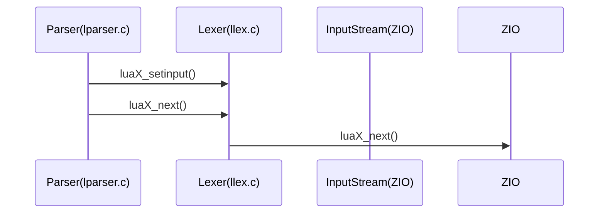

# References

[Lua - Github](https://github.com/lua/lua)
[Lua - DeepWiki](https://deepwiki.com/lua/lua)


# Lua処理系プロジェクト全体の詳細整理レポート
> :warning: LLM generated this section

## 1. このプロジェクトは何か？

このプロジェクトは「Lua」というプログラミング言語の**処理系（インタプリタ本体＋標準ライブラリ群）**をC言語で実装したものです。

- **Luaとは？**
  - 軽量・組み込み向けのスクリプト言語。
  - ゲームや組み込み機器、ツールの拡張言語として世界中で使われています。

- **このプロジェクトでできること**
  - Luaスクリプト（.luaファイル）をコマンドラインやREPL（対話モード）で実行できる
  - Luaの標準関数（print, assert, type, pairs など）を使える
  - Luaの構文・文法・型・制御構造・関数・テーブルなど、言語仕様をフルサポート

---

## 2. プロジェクト全体の構成（主なファイルと役割）

### 2.1 インタプリタ本体
- **lua.c**
  - Luaインタプリタのエントリポイント（main関数）。
  - コマンドライン引数処理、REPL（対話モード）、スクリプトファイルの実行、エラー処理など。

### 2.2 字句解析・構文解析・バイトコード生成
- **llex.c / llex.h**
  - 字句解析（トークン化）。ソースコードを「単語（トークン）」に分解。
- **lparser.c / lparser.h**
  - 構文解析（パース）。トークン列を文法規則に従って解析し、式や文の構造を理解。
  - 再帰下降構文解析を採用。
- **lcode.c / lcode.h**
  - バイトコード生成。パース結果をもとに仮想マシン用の命令列（バイトコード）を生成。

### 2.3 仮想マシン・実行系
- **lvm.c / lvm.h**
  - Luaバイトコードを解釈・実行する仮想マシン本体。
  - 算術演算、テーブル操作、関数呼び出し、制御構造などを実装。

### 2.4 標準ライブラリ
- **lbaselib.c**: 基本関数（print, assert, type, pairs など）
- **lmathlib.c, lstrlib.c, ltablib.c, liolib.c, loslib.c, lutf8lib.c, ldblib.c, lcorolib.c**: 数学、文字列、テーブル、I/O、OS、UTF-8、デバッグ、コルーチン等の標準ライブラリ

### 2.5 オブジェクト・関数・メモリ管理
- **lobject.c / lobject.h**: Lua値（数値・文字列・テーブルなど）の表現と操作
- **lfunc.c / lfunc.h**: 関数・クロージャの管理
- **lgc.c / lgc.h**: ガーベジコレクション（自動メモリ管理）
- **lmem.c / lmem.h**: メモリアロケーション

### 2.6 その他
- **lopcodes.c / lopcodes.h / lopnames.h / ljumptab.h**: バイトコード命令の定義や命令名テーブル
- **lstate.c / lstate.h**: Lua仮想マシンの状態管理
- **lstring.c / lstring.h**: 文字列管理
- **lauxlib.c / lauxlib.h, lualib.h**: C API補助・ライブラリ初期化
- **testes/**: Luaスクリプトによるテスト群。動作検証や回帰テストに利用。
- **manual/**: マニュアルやドキュメント。

---

## 3. Luaインタプリタの「処理の流れ」

1. **ソースコード入力**
   - ユーザーがLuaスクリプトを入力（ファイル/REPL）
2. **字句解析（llex.c）**
   - ソースコードをトークン（単語）に分解
3. **構文解析（lparser.c）**
   - トークン列を文法規則に従って解析し、式や文の構造を理解
   - 解析しながら「バイトコード生成用の中間表現（expdescなど）」を作る
4. **バイトコード生成（lcode.c）**
   - 構文解析結果をもとに仮想マシン用の命令列（バイトコード）を生成
5. **実行（lvm.c）**
   - 仮想マシンがバイトコードを1命令ずつ解釈・実行
   - 標準ライブラリやC APIもここから呼び出される

## 4. VK（expkind の要素）の役割と流れ

### 4.1 VKの意味
- `VK` は `expkind` 列挙型の一つであり、Luaの定数テーブル（Proto->k）に格納された定数値を表す。
- パーサ・コード生成段階でリテラル（数値・文字列・真偽値など）を一元的に「定数プール参照」として扱うための種別。

### 4.2 定数種別の流れ（具体例付き）

#### 例1: `1 + 2` という式の場合
1. **字句解析（llex.c）**
   - `1` → 整数リテラルとしてトークン化
   - `+` → 演算子トークン
   - `2` → 整数リテラルとしてトークン化
2. **構文解析（lparser.c）**
   - `1` → `expdesc.k = VKINT`（整数リテラル）
   - `2` → `expdesc.k = VKINT`
   - `+` のノードで左右の子をまとめる
3. **バイトコード生成（lcode.c）**
   - `VKINT` の値を定数テーブル（Proto->k）に登録し、`VK` に変換
   - 例えば `1` と `2` が定数テーブルの0番・1番に入る
   - `expdesc.k = VK`、`expdesc.u.info = 0`（1のインデックス）、`expdesc.u.info = 1`（2のインデックス）
   - `OP_LOADK` 命令でレジスタに定数をロードし、`OP_ADD` 命令で加算

#### 例2: `print(1+2)` の場合
1. `print` はグローバル関数として解決
2. `1+2` の部分は上記と同様に処理され、バイトコード上は
   - `OP_LOADK`（1）
   - `OP_LOADK`（2）
   - `OP_ADD`（加算結果をレジスタに）
   - `OP_GETGLOBAL`（print関数を取得）
   - `OP_CALL`（printを呼び出し）

#### 例3: 関数定義と呼び出し
```lua
function f(x) return x+1 end
f(10)
```
- `1` や `10` も同様に `VKINT` → `VK` へ変換され、定数テーブルに格納
- 関数本体のバイトコードにも `OP_LOADK`（1）や `OP_ADD` などが現れる
- 呼び出し側は `OP_LOADK`（10）→ `OP_GETGLOBAL`（f）→ `OP_CALL` という流れ

このように、**リテラル値（数値・文字列など）は最初は型ごとに細分類されるが、最終的にはVKとして定数テーブルにまとめられ、バイトコード命令からインデックスで参照される**という流れになります。

### 4.3 コード生成への橋渡し
- `VK` 種別の式は、`luaK_codek(fs, reg, e->u.info)` のようにバイトコード `OP_LOADK`（または `OP_LOADKX`）を生成してレジスタに定数をロードする。
- 定数の数が小さければ命令引数に直接埋め込む最適化（`GETRK` マクロ）も行われる。

### 4.4 VKの意義
- 字句解析時点では型ごとにリテラル種別を区別するが、コード生成時に一元的に扱うため `VK` に集約。
- これにより、数値・文字列・真偽値などをまとめて定数テーブルから参照し、バイトコード生成の実装をシンプルに保つ。

## 5. プロジェクトの設計思想・特徴
- パースと同時にバイトコード生成を行うワンパス設計。
- スコープ・変数・ラベル・gotoなどの管理が厳密。
- 標準ライブラリやREPL、テストスイート、マニュアルも備え、実用的なLua処理系として完結している。


# コードリーディング

> :warning: Human create this section.

## フロントエンド



## 構造体

### 字句解析のキー構造体
`LexState`


